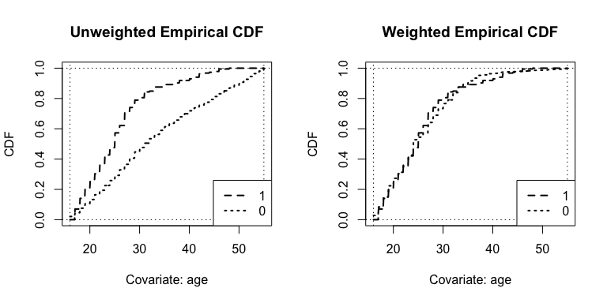
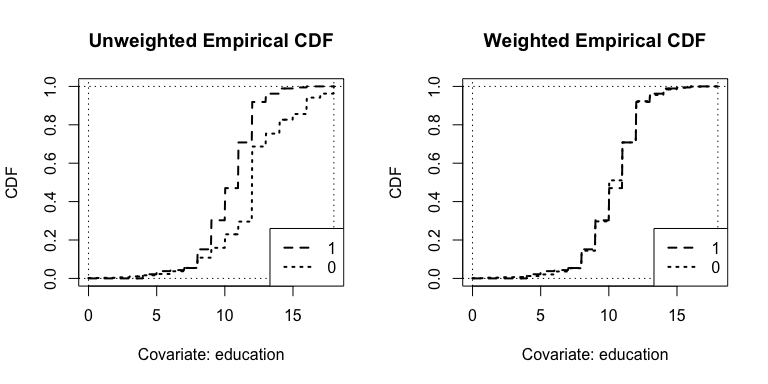
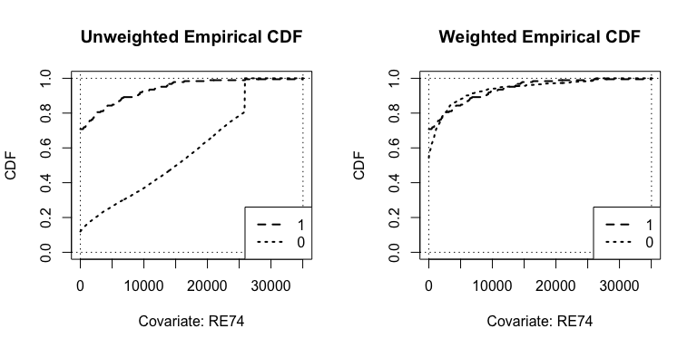
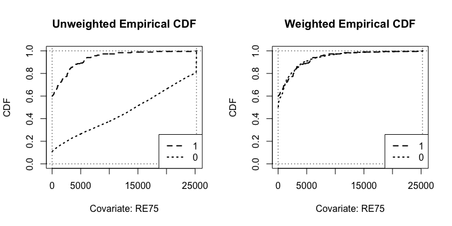
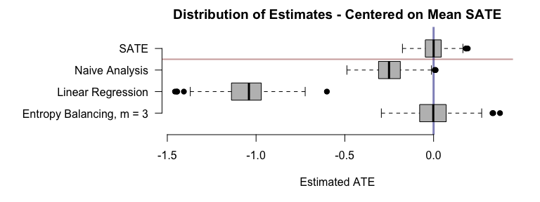

<!-- README.md is generated from README.Rmd. Please edit that file -->

# entbal - An alternative implementation of entropy balancing weights

<!-- badges: start -->

<!-- badges: end -->

The goal of entbal is to create an easy to use implementation of the
entropy balancing algorithm outlined in Hainmueller (2012) for applied
researchers to use. **Note that this is a work in progress**

Hainmueller, Jens. “Entropy balancing for causal effects: A multivariate
reweighting method to produce balanced samples in observational
studies.” Political Analysis 20.1 (2012): 25-46.

## Installation

You can install the development version from
[GitHub](https://github.com/) with:

``` r
# install.packages("devtools")
devtools::install_github("bvegetabile/entbal")
```

## Example of Estimating Entropy Balancing Weights - ATT

This is a basic example that shows how to obtain weights on a simple
dataset from Dehejia and Wahba (1999).

Dehejia, Rajeev H., and Sadek Wahba. “Causal effects in nonexperimental
studies: Reevaluating the evaluation of training programs.” Journal of
the American statistical Association 94.448 (1999): 1053-1062.

In the dataset the goal is estimating postintervention earnings after
inclusion into a job training program. The variables *age*, *education*,
*black*, *hispanic*, *married*, *nodegree*, *RE74*, and *RE75*, all
represent pre-exposure variables. The variables *RE74*, *RE75*,
represent “retrospective earnings” in 1974 and 1975 respectively. The
variable *RE78* represents the outcomes of earnings in 1978. Finally,
the variable *TA* represents the indicator of inclusion in the treatment
program.

The original DW99 paper contains six control datasets. The example below
uses a control group from the Current Population Survey (CPS1) and is
the largest dataset examined in DW99.

``` r
library(entbal)
library(survey, quietly = T, warn.conflicts = F, verbose = F)
dset <- dw99cps1

eb_pars <- list(exp_type = 'binary',
                estimand = 'ATT',
                n_moments = 3, 
                optim_method = 'L-BFGS-B',
                verbose = T,
                opt_constraints = c(-250,250),
                bal_tol = 1e-8,
                max_iters = 1000,
                which_z = 1)
estwts <- entbal(TA ~ age + education + black + hispanic + married + nodegree + RE74 + RE75,
                 data = dset,
                 eb_pars = eb_pars)
#> iter   10 value -3.573880
#> iter   20 value -3.608738
#> iter   30 value -3.612042
#> iter   40 value -3.612062
#> final  value -3.612062 
#> converged
summary(estwts)
#> Reference levels for headers:
#> --------------------------------------------------------------------------------
#> Exposure 0: 0 
#> Exposure 1: 1 
#> --------------------------------------------------------------------------------
#> Unweighted Balance Statistics:
#> --------------------------------------------------------------------------------
#>           MeanGroup1 SEGroup1 MeanGroup0 SEGroup0 StdDiffMeans LogRatioSE MaxKS
#> age            25.82     7.14      33.23    11.04        -0.80      -0.44  0.34
#> education      10.35     2.01      12.03     2.87        -0.68      -0.36  0.41
#> black           0.84     0.36       0.07     0.26         2.43       0.13  0.77
#> hispanic        0.06     0.24       0.07     0.26        -0.05       0.06  0.01
#> married         0.19     0.39       0.71     0.45        -1.23       0.15  0.52
#> nodegree        0.71     0.45       0.30     0.46         0.91       0.21  0.41
#> RE74         2095.57  4873.40   14016.80  9569.50        -1.57      -0.67  0.60
#> RE75         1532.06  3210.54   13650.80  9270.11        -1.75      -1.06  0.65
#> --------------------------------------------------------------------------------
#> Weighted Balance Statistics:
#> --------------------------------------------------------------------------------
#>           MeanGroup1 SEGroup1 MeanGroup0 SEGroup0 StdDiffMeans LogRatioSE MaxKS
#> age            25.82     7.14      25.82     7.14            0          0  0.07
#> education      10.35     2.01      10.35     2.01            0          0  0.04
#> black           0.84     0.36       0.84     0.36            0          0  0.00
#> hispanic        0.06     0.24       0.06     0.24            0          0  0.00
#> married         0.19     0.39       0.19     0.39            0          0  0.00
#> nodegree        0.71     0.45       0.71     0.45            0          0  0.00
#> RE74         2095.57  4873.40    2095.60  4873.43            0          0  0.16
#> RE75         1532.06  3210.54    1532.14  3211.08            0          0  0.10
#> --------------------------------------------------------------------------------
#> TA: 1,   Original N = 185
#>        Weighted ESS = 185
#> TA: 0,   Original N = 15992
#>        Weighted ESS = 116.45
#> --------------------------------------------------------------------------------
```

### Diagnostic Plots

We can visualize the weighted ECDF as a visual balance diagnostic. We
only need to do this for continuous variables as we can see from the
summary table that the binary variables are balanced. These should be
the columns of estwts$X that are
continuous.

``` r
plot(estwts, which_vars = c(1,2,7,8))
```



These plots demonstrate very good balance on the empirical distribution.

### Outcome Modeling

To estimate the effect of the job training program on postintervention
earnings we can use the survey package to estimate the effect of
treatment.

``` r
dset$wts <- estwts$wts
design <- svydesign(ids=~1, weights=~wts, data = dset)
resp <- svyglm(RE78 ~ TA,
               design = design)
summary(resp)
#> 
#> Call:
#> svyglm(formula = RE78 ~ TA, design = design)
#> 
#> Survey design:
#> svydesign(ids = ~1, weights = ~wts, data = dset)
#> 
#> Coefficients:
#>             Estimate Std. Error t value Pr(>|t|)    
#> (Intercept)   4957.1      434.9  11.397   <2e-16 ***
#> TA            1392.1      722.5   1.927    0.054 .  
#> ---
#> Signif. codes:  0 '***' 0.001 '**' 0.01 '*' 0.05 '.' 0.1 ' ' 1
#> 
#> (Dispersion parameter for gaussian family taken to be 61441400)
#> 
#> Number of Fisher Scoring iterations: 2
```

We see that the estimating difference in the post-intervention earnings
is approximately $1392. An additional analysis could controlling for
additional variables, as
follows:

``` r
resp <- svyglm(RE78 ~ TA + age + education + black + hispanic + married + nodegree + RE74 + RE75,
               design = design)
summary(resp)
#> 
#> Call:
#> svyglm(formula = RE78 ~ TA + age + education + black + hispanic + 
#>     married + nodegree + RE74 + RE75, design = design)
#> 
#> Survey design:
#> svydesign(ids = ~1, weights = ~wts, data = dset)
#> 
#> Coefficients:
#>               Estimate Std. Error t value Pr(>|t|)  
#> (Intercept) -2.875e+03  6.055e+03  -0.475   0.6349  
#> TA           1.392e+03  7.013e+02   1.985   0.0471 *
#> age          8.299e+01  7.481e+01   1.109   0.2673  
#> education    6.226e+02  3.574e+02   1.742   0.0815 .
#> black       -1.147e+03  1.550e+03  -0.740   0.4595  
#> hispanic     3.064e+02  2.656e+03   0.115   0.9082  
#> married      1.016e+03  1.469e+03   0.692   0.4892  
#> nodegree    -3.120e+02  1.828e+03  -0.171   0.8645  
#> RE74         4.075e-02  2.450e-01   0.166   0.8679  
#> RE75         9.154e-02  1.947e-01   0.470   0.6382  
#> ---
#> Signif. codes:  0 '***' 0.001 '**' 0.01 '*' 0.05 '.' 0.1 ' ' 1
#> 
#> (Dispersion parameter for gaussian family taken to be 58371679)
#> 
#> Number of Fisher Scoring iterations: 2
```

We see that the results do not change much and that our point estimate
is the same.

## Simulated Demo on Estimating the ATE

Below is a demonstration of estimating the average treatment effect

``` r
set.seed(2019)

library(entbal)
library(survey)
n_obs <- 2500
n_sims <- 500

ebp <- list(exp_type = 'binary',
            estimand = 'ATE',
            n_moments = 3, 
            optim_method = 'L-BFGS-B',
            verbose = F,
            opt_constraints = c(-250,250),
            bal_tol = 1e-8,
            max_iters = 1000)

outro <- matrix(NA, nrow = n_sims, ncol = 4)
start_time <- Sys.time()
for(i in 1:n_sims){
  
  X1 <- rnorm(n_obs)
  X2 <- rnorm(n_obs)
  X3 <- rnorm(n_obs)
  
  ps <- plogis(1.5 + 1.2 * X1 - 1.5 * X2 + 0.5 * X3)
  
  TA <- rbinom(n_obs, 1, ps)
  
  Y1 <- X1^2 + X2^2 + X3^2 + 10 + rnorm(n_obs)
  Y0 <- -(X1 + X2 + X3) + rnorm(n_obs)
  
  Yobs <- TA * Y1 + (1 - TA) * Y0
  
  dset <- data.frame('X1' = X1,
                     'X2' = X2,
                     'X3' = X3,
                     'TA' = TA,
                     'Y' = Yobs)
  
  SATE <- mean(Y1-Y0)
  
  # Naive Estimate - Only taking group means
  Naive <- mean(dset$Y[dset$TA == 1]) - mean(dset$Y[dset$TA == 0])
  
  # Linear Regression - Controlling for X1, X2, X3, - Complete Case Analysis
  LR <- lm(Y ~ TA + X1 + X2 + X3, data = dset)
  
  # Entropy Balancing ATE
  wts <- entbal(TA ~ X1 + X2 + X3 ,
                data = dset,
                eb_pars = ebp)
  dset$wts <- wts$wts
  design <- svydesign(ids=~1, weights=~wts, data = dset)
  resp <- svyglm('Y ~ TA', design = design)
  
  # Storing outputs
  outro[i,] <- c(SATE, Naive, coef(LR)[2], coef(resp)[2])
  if(!(i%%100)) {
    end_time <- Sys.time()
    message(
      paste(i, ' Iters, Time per iter:', 
            round(difftime(end_time, start_time, units = 'secs'),3),
            sep = '')
    )
    start_time <- Sys.time()
  }
}
#> 100 Iters, Time per iter:4.391
#> 200 Iters, Time per iter:4.112
#> 300 Iters, Time per iter:4.149
#> 400 Iters, Time per iter:4.232
#> 500 Iters, Time per iter:4.48
colnames(outro) <- c('SATE',
                     'Naive Analysis',
                     'Linear Regression',
                     'Entropy Balancing, m = 3')

par(mar=c(5,12,2,2))
plot(0, ylim = c(0,5), xlim = range(outro - mean(outro[,1])),
     pch = 19, col = rgb(0,0,0,0),
     xlab = 'Estimated ATE', ylab = '', axes = F, yaxs='i',
     main = 'Distribution of Estimates - Centered on Mean SATE')
lines(c(0,0), c(0, 10), lwd = 3, col = rgb(0,0,0.5,0.5))
boxplot((outro - mean(outro[,1]))[,4:1], horizontal=T, axes = F, add = T,
        col = 'gray', pch = 19)
axis(1); axis(2, las=2, at = 4:1, labels = colnames(outro))
abline(h = c(3.5,8.5), lwd = 2, col = rgb(0.5,0,0,0.4))
```


